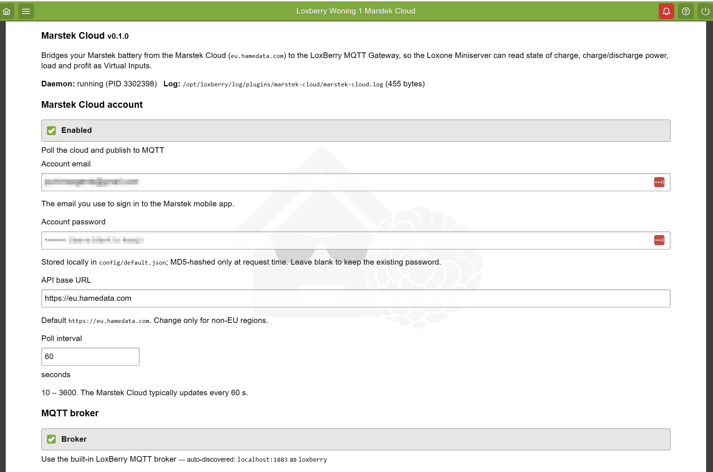
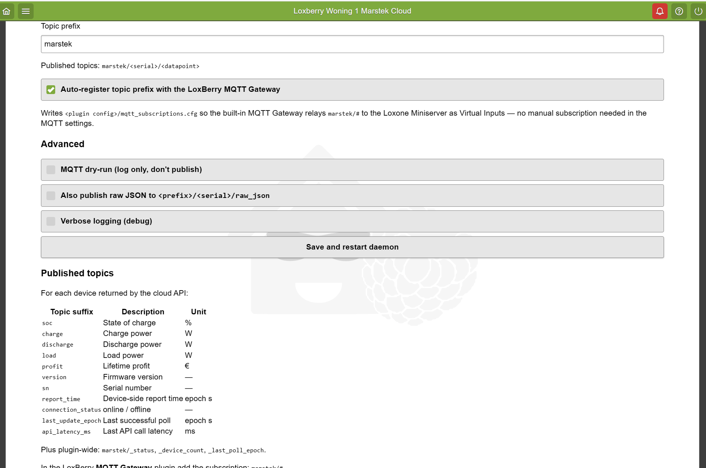
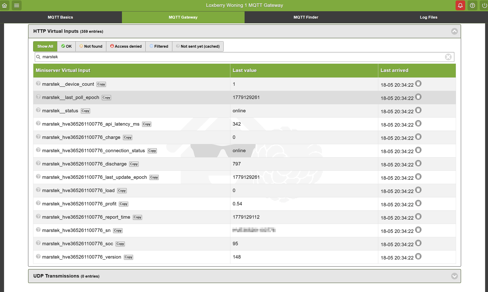

# LoxBerry — Marstek Cloud Plugin

[](LICENSE)
[](https://wiki.loxberry.de/)
[](#status)

Bridges the **Marstek Cloud** (`eu.hamedata.com`, used by the official Marstek
mobile app) into a Loxone Miniserver via the LoxBerry built-in MQTT Gateway.

The plugin logs into the Marstek cloud API, polls the device list at a
configurable interval, and re-publishes every relevant datapoint as a
retained MQTT message — one topic per datapoint per device. The built-in
LoxBerry MQTT Gateway picks the topics up automatically and exposes them to
Loxone Config as Virtual Inputs.

API endpoints and the datapoint set were derived from the
[`DoctaShizzle/marstek_cloud`](https://github.com/DoctaShizzle/marstek_cloud)
Home Assistant integration plus our own live probes against the EU endpoint.

## Status

**Pre-release / v0.1.0.** Functionally complete; tested end-to-end against
the real Marstek cloud API and the LoxBerry built-in MQTT Gateway inside a
sandbox container, and confirmed running on a physical LoxBerry 3.0.1.2
(Raspberry Pi 4, aarch64) — see screenshots below. Treat as beta and
report any rough edges via Issues.

## Screenshots

**Plugin settings page — account section.** Renders inside the LoxBerry
shell, shows the live daemon state and log path/size:



**Plugin settings page — MQTT + advanced.** The *Use the built-in
LoxBerry MQTT broker* checkbox is on by default and shows the
auto-discovered broker line; the *Auto-register topic prefix* checkbox
drops `<prefix>/#` into the built-in MQTT Gateway with no manual
subscription step:



**LoxBerry MQTT Gateway — live virtual inputs flowing to Loxone.** All
`marstek/<sn>/<datapoint>` and `marstek/_status` / `_device_count` /
`_last_poll_epoch` topics arrive at the Miniserver as Virtual Inputs,
all status **OK**:



## Download

Direct link to the installable ZIP for the current release (v0.1.0):

```
https://github.com/jovd83/loxberry-marstek-cloud/releases/download/v0.1.0/marstek-cloud-0.1.0.zip
```

Version-agnostic "always-latest" URL (GitHub redirects to whichever release
is marked latest — currently v0.1.0):

```
https://github.com/jovd83/loxberry-marstek-cloud/releases/latest/download/marstek-cloud-0.1.0.zip
```

Or browse the release page:
<https://github.com/jovd83/loxberry-marstek-cloud/releases/tag/v0.1.0>

You can also pull it directly on the LoxBerry host with:

```bash
curl -LO https://github.com/jovd83/loxberry-marstek-cloud/releases/download/v0.1.0/marstek-cloud-0.1.0.zip
```

## Features

- **Zero-config MQTT** — checkbox *"Use the built-in LoxBerry MQTT broker"*
  is on by default. The daemon auto-discovers host, port, username and
  password from LoxBerry's `general.json` via `LoxBerry::IO`; no manual
  broker credentials needed in the plugin page.
- **Auto-registers the topic prefix** with the built-in LoxBerry MQTT
  Gateway by dropping a `mqtt_subscriptions.cfg` file the gateway watches
  with inotify — no manual subscription step in MQTT Gateway settings.
- **Retained MQTT messages** for each Marstek datapoint:
  `soc`, `charge`, `discharge`, `load`, `profit`, `version`, `sn`,
  `report_time` (configurable list).
- **Per-device diagnostics:** `connection_status`, `last_update_epoch`,
  `api_latency_ms`.
- **Plugin-wide health:** `marstek/_status`, `marstek/_device_count`,
  `marstek/_last_poll_epoch`.
- **Configurable poll interval** (10 – 3 600 s; default 60 s).
- **Token caching + auto-refresh** on API code `8` (expired-token) — keeps
  long-running daemons stable across token rotation.
- **Ignored-device-type filter** (default `["HME-3"]`, matching the HA
  integration's choice).
- **MQTT dry-run mode** — logs values without publishing, useful for first-
  run smoke tests.
- **Optional raw-JSON topic** — `<sn>/raw_json` carries the full device
  payload for debugging.
- **Security guard-rails:**
  - Marstek password stored at `0600` in `default.json` (no other host user
    can read it).
  - The login URL with `pwd=<md5>` and `mailbox=<email>` is **redacted** in
    every error log message.
  - `api_base_url` is allow-list-validated on both save and daemon
    start-up — only `*.hamedata.com` or `localhost` are accepted, blocking
    the CSRF + credential-exfil chain.

## Requirements

- **LoxBerry ≥ 3.0** (plugin uses `INTERFACE=2.0`; LoxBerry 3.0.x is the
  current stable branch).
- A working **Marstek account** with at least one paired device.
  > [!IMPORTANT]
  > **Account Sharing Requirement:** You should create a **second account** in the Marstek app, share your battery/devices with it, and use that second account in the plugin. If you use your main account in both the mobile app and this plugin, you will be repeatedly logged out of the mobile app.
  > 
  > **API Endpoints:** The default API URL (`https://eu.hamedata.com`) only works in Europe. Other continents should use their respective region's API URL (which must belong to the `*.hamedata.com` domain).
- LoxBerry's built-in MQTT broker (mosquitto) and built-in MQTT Gateway
  must be running — both ship enabled by default in LoxBerry 3.0.

> **Note:** the standalone *"MQTT Gateway"* plugin from `christianTF` is
> for LoxBerry 2.x and is **blocked on LoxBerry 3.0**. LoxBerry 3.0 ships
> its replacement built-in. This plugin uses the built-in one.

## Installation

1. Grab `marstek-cloud-<version>.zip` from the [**Download**](#download)
   section above.
2. In LoxBerry: **Plugin Management → Plugin Install**, upload the ZIP,
   enter your **SecurePIN**, click *Install*.
3. Open the plugin tile — it appears under *Plugin Settings*.
4. Enter your **Marstek email + password**. Leave *"Use the built-in
   LoxBerry MQTT broker"* checked. Click *Save and restart daemon*.
5. Within a few seconds:
   - The status line on the plugin page should read `running (PID …)`.
   - `marstek/_status` becomes `online` over MQTT.
   - Per-device topics start arriving at `marstek/<serial>/<datapoint>`.
6. In Loxone Config, the MQTT Gateway will expose each topic as a Virtual
   Input automatically.

### Configuration reference

The plugin page is the recommended UI. The underlying file is
`/opt/loxberry/config/plugins/marstek-cloud/default.json` (mode `0600`,
owner `loxberry:loxberry`) — fields:

| Key | Default | Notes |
|---|---|---|
| `enabled` | `true` | Master switch — when off, daemon exits cleanly. |
| `email` | `""` | Marstek account email. Required. Whitespace stripped on save. |
| `password` | `""` | Marstek account password. Required. Stored locally, MD5-hashed only at request time. Whitespace stripped on save. |
| `api_base_url` | `https://eu.hamedata.com` | Marstek API base. Defaults to the Europe region endpoint. Other continents must use their respective regional API URL (e.g. under the `*.hamedata.com` domain). Validated against allow-list: `*.hamedata.com` and `localhost` only. |
| `poll_interval_seconds` | `60` | Clamped to 10 – 3 600. |
| `request_timeout_seconds` | `15` | Per-request HTTP timeout, clamped to 3 – 120. |
| `request_attempts` | `3` | Retries per call, exponential backoff capped at 10 s, clamped 1 – 10. |
| `use_loxberry_mqtt` | `true` | Auto-discover broker host/port/user/pass from LoxBerry. **Recommended.** Uncheck only to publish to a non-LoxBerry broker. |
| `mqtt_host` | `localhost` | Only consulted when `use_loxberry_mqtt=false`. |
| `mqtt_port` | `1883` | Only consulted when `use_loxberry_mqtt=false`. |
| `mqtt_username` / `mqtt_password` | `""` | Only consulted when `use_loxberry_mqtt=false`. |
| `mqtt_topic_prefix` | `marstek` | First segment of every published topic. Regex-sanitised to `[A-Za-z0-9_.-]+` on load. |
| `mqtt_dry_run` | `false` | When `true`, log values instead of publishing. |
| `register_mqtt_subscription` | `true` | Write `<prefix>/#` to `<plugin-config>/mqtt_subscriptions.cfg` so the built-in MQTT Gateway relays the topics to Loxone. |
| `publish_raw_json` | `false` | Also publish full device JSON to `<prefix>/<sn>/raw_json`. |
| `ignored_device_types` | `["HME-3"]` | Skip devices whose `type` field is in this list. |
| `data_points` | see file | Which device fields to forward. Unknown keys are silently skipped. |
| `debug` | `false` | Verbose logging. |

## MQTT topic reference

Per-device, replacing `<prefix>` with your configured prefix (default `marstek`)
and `<sn>` with the device serial:

| Topic | Meaning | Unit |
|---|---|---|
| `<prefix>/<sn>/soc` | State of charge | % |
| `<prefix>/<sn>/charge` | Charge power | W |
| `<prefix>/<sn>/discharge` | Discharge power | W |
| `<prefix>/<sn>/load` | Load power | W |
| `<prefix>/<sn>/profit` | Lifetime profit | € |
| `<prefix>/<sn>/version` | Firmware version | — |
| `<prefix>/<sn>/sn` | Serial number | — |
| `<prefix>/<sn>/report_time` | Device-side report time | epoch s |
| `<prefix>/<sn>/connection_status` | `online` after a successful poll | — |
| `<prefix>/<sn>/last_update_epoch` | Last successful poll | epoch s |
| `<prefix>/<sn>/api_latency_ms` | Last API call round-trip | ms |
| `<prefix>/<sn>/raw_json` | Full device JSON (opt-in via `publish_raw_json`) | — |

Plugin-wide:

| Topic | Meaning |
|---|---|
| `<prefix>/_status` | `online` after each successful poll, `error` after a failed cycle, `offline` on shutdown |
| `<prefix>/_device_count` | Number of non-ignored devices in the last poll |
| `<prefix>/_last_poll_epoch` | Epoch seconds of the last successful poll |

Full Loxone Config mapping guidance is in
[`docs/LOXONE_CONFIG.md`](docs/LOXONE_CONFIG.md).

## Logs

| Path | Contents |
|---|---|
| `/opt/loxberry/log/plugins/marstek-cloud/marstek-cloud.log` | Daemon stdout — info/warning/error lines |
| `/opt/loxberry/log/plugins/marstek-cloud/daemon-stderr.log` | Daemon stderr (tracebacks etc.) |
| `/opt/loxberry/log/plugins/marstek-cloud/daemon-restart.log` | Output of `daemon restart` actions triggered by the web UI |

The plugin page surfaces the daemon's current state at the top
(`running / disabled / not configured / stopped`) plus the log path and size.

## Troubleshooting

| Symptom | Likely cause | Fix |
|---|---|---|
| Status reads `not configured (enter Marstek email + password)` | Credentials are empty in `default.json` (typical right after install — the LoxBerry installer overwrites `config/*` on every install) | Enter email + password on the plugin page and click *Save and restart daemon*. |
| Daemon log: `Login response missing token: {'code': '4', 'msg': '密码错误', ...}` | Wrong password — most often a leading/trailing space pasted from a password manager | Re-enter the password in the form; whitespace is now stripped on save. |
| Daemon log: `{'code': '3', 'msg': '该邮箱暂未注册', ...}` | Marstek does not recognise this email | Verify the email is the exact one you use in the Marstek mobile app, and that the account region matches `api_base_url` (default is EU). |
| `Refusing to start: api_base_url host '…' is not on the allow-list` | A non-`hamedata.com` URL was saved in `default.json` (hand-edited or via the form) | Restore to `https://eu.hamedata.com` (or another regional Marstek endpoint on the `*.hamedata.com` domain). |
| Topics appear in `mosquitto_sub -t '#'` but **not** in Loxone | LoxBerry's built-in MQTT Gateway is not running or has not picked up `mqtt_subscriptions.cfg` | Check *System → MQTT → Gateway* in the LoxBerry UI; confirm `<prefix>/#` is in the subscription list. The plugin writes this file on every daemon start. |
| `_status` stuck on `error` even after fixing creds | Daemon got stuck on a cached token | The plugin auto-handles this since v0.1.0 (code-as-string fix). If still stuck, *Save and restart daemon* on the plugin page. |
| `Missing dependency: paho-mqtt` | apt step failed at install time | `sudo apt-get install -y python3-paho-mqtt` on the LoxBerry host, then restart the plugin daemon. |

## Development

This repository is the standalone home of the `loxberry-marstek-cloud` plugin. 

### Packaging the Plugin
To install or update the plugin on a LoxBerry host, it must be packaged into a `.zip` file with a specific folder structure (the root directory inside the archive must match the plugin name `marstek-cloud`).

To build this package easily, run the provided helper script:

```bash
python build_zip.py
```

This script will automatically:
1. Parse `plugin.cfg` to extract the correct name and version.
2. Package all source files into a LoxBerry-compliant ZIP file (e.g., `marstek-cloud-0.1.0.zip`).
3. Automatically search for a sibling [`loxberry-integrator`](https://github.com/jovd83/loxberry-integrator) repository and copy the built ZIP directly into its `sandbox/` directory for immediate local testing.

### Sandbox Testing
For end-to-end testing without dedicated hardware, you can use the dockerized LoxBerry sandbox (`boernmasta/loxberry:latest`, LoxBerry 3.0.1.3) shipped inside the sibling [`loxberry-integrator`](https://github.com/jovd83/loxberry-integrator) repository:
1. Run `python build_zip.py` to compile the package and auto-copy it to the sandbox incoming directory.
2. Follow the setup and install instructions inside the `loxberry-integrator` sandbox: see `sandbox/tools/README.md` in that repository for compose configurations and installation commands.

## Credits

- API contract reverse-engineered from [`DoctaShizzle/marstek_cloud`](https://github.com/DoctaShizzle/marstek_cloud) (Home Assistant integration). Without that excellent prior art, this plugin would not exist.
- LoxBerry plugin scaffolding generated by the [`loxberry-integrator`](https://github.com/jovd83/loxberry-integrator) agent skill.

## License

MIT — see [LICENSE](LICENSE).
